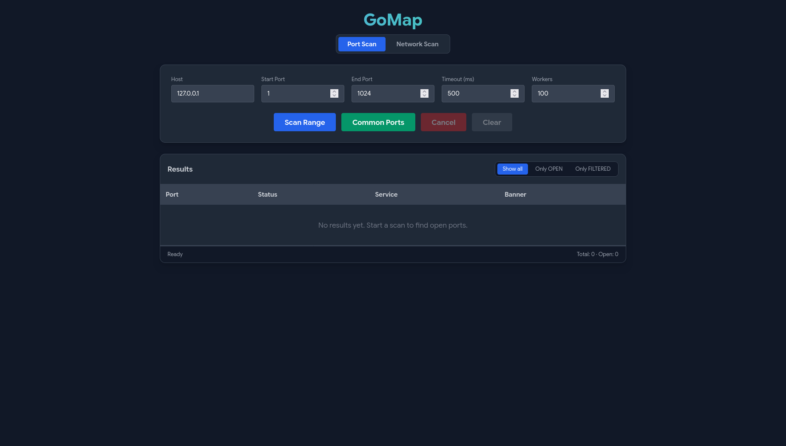

# GoMap

A lightweight port scanner desktop app built with a **Go** backend and **React** frontend via [Wails](https://wails.io). Scans TCP ports, grabs service banners, detects live hosts on a network, and displays results in real time through a dark-themed UI.

Built as a learning project to explore Go's networking primitives, goroutine worker pools, and Wails as a desktop app framework.



## Download

Prebuilt binaries for Linux and Windows are available on the [Releases](../../releases) page:

| Platform | File |
|---|---|
| Linux (x64) | `GoMap-linux-amd64` |
| Windows (x64) | `GoMap-windows-amd64.exe` |

A **latest** pre-release is updated automatically on every push to `main`.

## Features

- **Port Range Scan** — scan any TCP port range with configurable timeout and worker count
- **Common Ports Preset** — one-click scan of ~80 well-known ports (SSH, HTTP, databases, DevOps tools, etc.)
- **Network Discovery** — scan a CIDR range (e.g. `192.168.1.0/24`) to find live hosts via TCP probing
- **Banner Grabbing** — reads service banners from open ports (SSH version, HTTP headers, etc.)
- **Service Detection** — maps port numbers to known service names (100+ entries)
- **Real-time Results** — ports appear as they are found, no waiting for the full scan to finish
- **Filter** — show all results, only open ports, or only filtered (firewalled) ports
- **Progress Tracking** — live progress bar, scanned/total counter, and ports/sec speed
- **Cancel** — gracefully stop any scan mid-way

## Tech Stack

| Layer    | Technology                                                                 |
| -------- | -------------------------------------------------------------------------- |
| Backend  | [Go](https://go.dev) — `net` package, goroutine worker pools, context cancellation |
| Frontend | [React](https://react.dev) + [Tailwind CSS](https://tailwindcss.com)       |
| Desktop  | [Wails v2](https://wails.io) — wraps the app in a native webview window    |

## Project Structure

```
GoMap/
├── app.go           # Core logic — StartScan, StartScanList, ScanNetwork, CancelScan
├── main.go          # Wails app entry point
├── wails.json       # Wails project config
├── go.mod
├── go.sum
└── frontend/
    ├── src/
    │   ├── App.jsx  # Main React UI — scan form, results table, event listeners
    │   └── main.jsx
    ├── index.html
    ├── package.json
    ├── tailwind.config.js
    └── vite.config.js
```

## Getting Started

### Prerequisites

- [Go](https://go.dev/dl/) 1.21+
- [Node.js](https://nodejs.org/) 18+
- [Wails CLI](https://wails.io/docs/gettingstarted/installation) — `go install github.com/wailsapp/wails/v2/cmd/wails@latest`
- On Linux: `webkit2gtk` — e.g. `sudo dnf install webkit2gtk4.1-devel` on Fedora

Verify your setup:

```bash
wails doctor
```

### Development

```bash
wails dev
```

Opens the app in a live-reload window. Go changes restart the backend; React changes hot-reload instantly.

### Build

```bash
wails build
```

Produces a single native binary in `build/bin/`.

### Note for Modern Linux Users

Modern Linux distributions (Fedora 40+, Ubuntu 24.04+, Debian 13+, etc.) have deprecated the `webkit2gtk-4.0` package in favor of `webkit2gtk-4.1`. If you see a **`libwebkit Not Found`** error when trying to run the app, you need to:

1. Install the **4.1** development package for your distro. For example:

   ```bash
   # Fedora
   sudo dnf install webkit2gtk4.1-devel

   # Ubuntu / Debian
   sudo apt install libwebkit2gtk-4.1-dev
   ```

2. Run the project with the `webkit2_41` build tag:

   ```bash
   wails dev -tags webkit2_41
   ```

   For production builds, use the same tag:

   ```bash
   wails build -tags webkit2_41
   ```

## How It Works

1. **Port scanning** uses `net.DialTimeout` over TCP. A full connection is attempted for each port — if it succeeds the port is `OPEN`, if it times out it's `FILTERED` (likely firewalled), and if it's refused it's `CLOSED` (silently skipped by default).
2. **Worker pool** — a configurable number of goroutines pull ports from a channel concurrently, making large scans significantly faster than sequential scanning.
3. **Cancellation** — each scan runs under a `context.WithCancel`. The `CancelScan` method triggers the cancel function (protected by a mutex to avoid data races), and all workers exit cleanly via a `select` check at the top of their loop.
4. **Real-time UI** — Go emits a `port_result` Wails event the instant a port state is determined. The React frontend buffers incoming events and flushes them to state every 300ms to avoid excessive re-renders.
5. **Banner grabbing** — after confirming a port is open, a 500ms read deadline is set on the connection. Any bytes received are emitted as a separate `port_banner` event and injected into the matching table row.
6. **Network discovery** — `ScanNetwork` parses a CIDR with `net.ParseCIDR`, iterates all host addresses, and probes each one on ports `22, 80, 443, 8080, 3389, 8443`. The first successful connection marks the host as live.

## License

This project is licensed under the [MIT License](LICENSE).